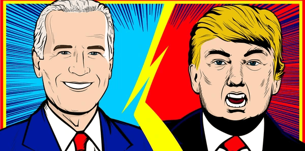

# Setup Instructions

An in-depth paragraph about your project and overview of use.

## Ollama Setup


### Download Ollama

https://ollama.com/download

### Run Ollama

```
ollama run llama3.2:3b
```

Make sure this chatbot is always running when you are trying to run the trump and biden chatbot program.

## Trump and Biden Chatbot Setup

### Clone this Repository

```
git clone https://github.com/k324b/ECE495.git
```

```
cd ece495
```

### Create Virtual Environment

```
python -m venv venv
```

### Activate Virtual Environment

Windows cmd.exe

```
venv\Scripts\activate.bat
```

Windows powershell

```
venv\Scripts\Activate.ps1
```

MacOS

```
source venv/bin/activate
```

### Install Dependencies

```
pip install numpy openai-whisper torch SpeechRecognition rich langchain langchain-core langchain-community langchain-ollama pyttsx3 pyaudio
```

## Run Chatbot Program



### Run Trump Bot

Windows

```
python trump.py
```

MacOS

```
python3 trump.py
```

### Run Biden Bot

Windows

```
python biden.py
```

MacOS

```
python3 biden.py
```

